  
  
  
  

  
  <picture>
  <source media="(prefers-color-scheme: dark)" srcset="https://raw.githubusercontent.com/MK-1407/MK-1407/output/github-contribution-grid-snake-dark.svg">
  <source media="(prefers-color-scheme: light)" srcset="https://raw.githubusercontent.com/MK-1407/MK-1407/output/github-contribution-grid-snake.svg">
  
</picture>
  
  
  

## 🛠️ Tech Stack

## 📊 GitHub Statistics

## 📫 Connect With Me

